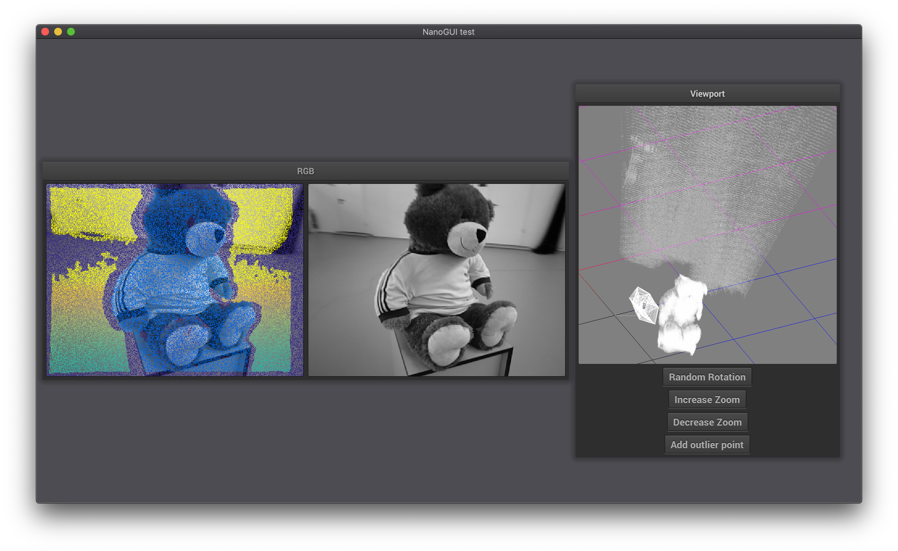

# Odometry-Visualization

> Visualization part for the [Direct Stereo Semi-dense Visual Odometry and 3D Reconstruction Project](https://github.com/WangYuTum/odometry)

## Install

To get to run the example (main.cpp), clone this repository with its submodules:

    git clone --recurse-submodules https://github.com/whateverforever/Odometry-Vis.git
    cd Odometry-Vis
    ./buildrun.sh

`buildrun.sh` is used to keep the top level clean, all build artifacts will be built in `build`.

## Current State

